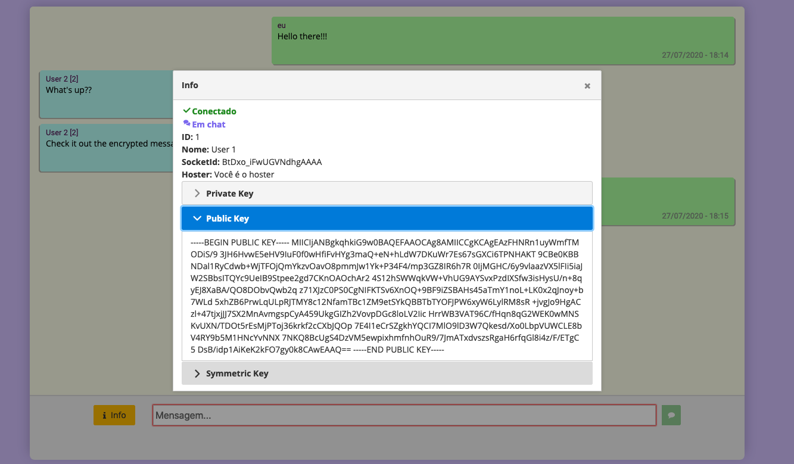

# Crypto Chat
## Activity for Network Topics's Course
---
### Objective   
The objective of this activity is to create a simple chat application that applies the concepts of cryptography through the user of symmetrical and asymmetrical keys. The messages must be encrypted with a symmetrical key and each client must be able to decrypt with de key. The symmetrical key must also be encrypted, but in this case with the public key of each client.   

The goal is to simulate a scenario where the messages can be shared securely.  
   
### This is the frontend of the application   
[Backend](https://github.com/kruchelski/cryptochatz-back)

### Overview
Here's an example screenshot of the application running

   

### In fewer words...   
* Client A wants to chat with client B;
* Client A encrypt the symmetric key using the public key from client B;
* Client A sends the cipher to the client B;
* Client B decrypts the cipher using it's own private key;
* Now both clients have the symmetric key;
* Client A encrypts it's message with the symmetric key;
* Client A sends the cipher of the message to client B;
* Client B decrypts the cipher of the message and reads te message;
* The process goes on the same way for client B (and for possible additional clients).

### Ingredients (Languages, frameworks, libraries and etc...)
The system have two applications:   
1. The client (CryptoChat)
2. The server (ChatServer)  

A head's up: You will need Node.JS and Angular CLI

#### Client and server
Both the applications made use of the following stuff:
* For the cryptography, the CryptoJS and hybrid-crypt were used:
[CryptoJS - NPM](https://www.npmjs.com/package/crypto-js)   

[Hybrid Crypto - NPM](https://www.npmjs.com/package/crypto-js)   

* For the connection with between client and server, the socket.io library was used:
[Socket.Io](https://socket.io/) (specific for the type - server or client)

#### The Client (CryptoChat directory)
The client was writen in Angular (version 9.1.0)
* For the styling the PrimeNG framework was used:
[PrimeNG's page](https://primefaces.org/primeng/showcase/#/setup) - Make sure to check how to get started because there there are some procedures on how to import the styling sheet and the icons   
   

#### The Server (ChatServer directory)
The server was written in Node.JS (version 12.16.1) with the express framework
[Node.JS](https://nodejs.org/en/)   

[Express framework](https://expressjs.com/pt-br/)   

#### ... and one more thing 
Except for the PrimeNG that have some minor stuff to deal, the rest of the things will be resolved with a simple `npm install --save`. That should do the trick.

### Starting the application
Start the server (ChatServer directory) with `npm start`, for example and start the client (CryptoChat directory) with `npm start`, for example. 
The server is served in the port 4444 and the client in the port 4200. So, after starting the client and the server, go to localhost:4200 with your favourite browser (best to avoid Internet Explorer) and voi la! The chat screen will be presented to you in all it's glory.
The server will print out some info on the console (in terminal, for example) during it's activity.

### How the applications works?
* The server controls the requests from each client emiting new messages and infos to everyone or directing the specific requests between connected clients.
* The connection of the client to the chat is made in two steps:

1. First the client must connect to the server
2. Then start (or enter) a chat

* When the client is instantied in the browser, the first thing that the application does is to generate a pair of RSA keys (public and private keys).
* After that, the client must enter a name to be able to connect in the server
* After the client connects, the server provide an ID number and the ID of the socket connection.
* Next, the client must type the symmetric key to be able to start a chat
* After that, the chat is started and everyone should be able to chat!

#### Screenshot showing Infos about the chat status (including the key pair and the symmetric key)

#### Important considerations
* When already there is a chat started, the client is notified about that when it connects to the server. At the same time the application request to the server the symmetric key. The server stores the info of who started the chat and then request to this client (the Hoster) the symmetric key, passing the public key of the client that made the request. The hoster client then encrypt the symmetric key with the public key provided by the server and then returns the cipher to server that returns the cipher to the client that requested the symmetric key. The client decrypt the cipher and get access to the symmetric key.
* If some client start the chat when another client is in the 'type the symmetric key' step, the second one is notified that a chat was initiated and then the application automatically requests the symmetric key repeating the stpe explained in the previous item.
* The ID provided by the server is an incremential integer. It will reset to zero only if the server side application dies
* When the chat hoster exits the chat, the next client that connected after it and that is still connected assumes the hoster function
* The only way to reset the symmetric password is if everyone in the active chat quits the application

### Last but not least
To test a lot of client just open lots of browsers windows and go to localhost:4200 in every window

### Very very last considerations
This project was made for study purpose and is not intended to be used as a profissional stuff or something like that. It's very possible that bugs may appear and improves can be made. Consider this as an application in alpha version... Something like v0.3.2.4.2.1

